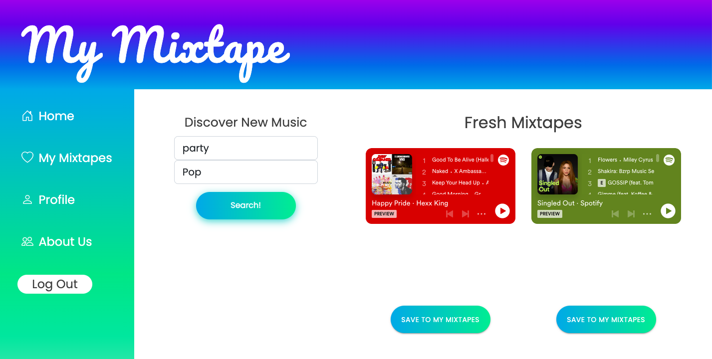

# My Mixtape

# Overview

Full-stack application that provides a user a variety of input selections such as keywords, genre, danceability, etc, and utilizes the user input to generate a playlist and save the playlist to their Spotify account. This application offers the user the convenience of getting an automated tailored playlist based on simple input measures.

# Key Features & How They Work

 
1. App generates a playlist based on selected data points
  - Using Spotify API data, user input connects to playlist data points like "genre" or "keyword" to find the perfect mix of songs that match your vibe.

2. User can implement all CRUD operations
  - User can get generated playlists, add them to their personal saved playlists page, annotate them, and delete them.
  - These permissions are implemented using READ, CREATE, UPDATE and DELETE methods in the Express server, wired to React components on the client server
 

3. Auth0 to login to Spotify
  - Auth0 and Spotify are wired up in the Express server so a user can log in using their personal Spotify account!
  - Saved playlists permissions are only accessible to the user who is logged in through their own Spotify account

# Planning
## Wireframe

[View Wireframe](https://www.figma.com/file/xIQELg7FpG63FYMe30BXL6/My-Mixtape-Wireframe?node-id=0%3A1)

## User Stories
[View User Stories and Kanban](https://github.com/orgs/ACES-301/projects/1/views/1)

## Domain Model
[View Domain Model](https://www.figma.com/file/4WPfVdQQkfS8Ul62t6Bfnm/My-Mixtape-Domain-Model?node-id=0%3A1)

# Database Schema

[View Database Schema](https://www.figma.com/file/P5vgHJaR7vauYDczwkTilQ/Database-Schema?node-id=0%3A1)

# Credit and Collaborations
- Spotify API Documentation
- Auth0 Documentation
- Authors: Ezgi Coban, Camilla Rees, Andra Steele and Stacy Yu
- With guidance and support from: Hexx King and Justin Hamerly

### [Deployed Site](https://mymixtape.netlify.app/)
